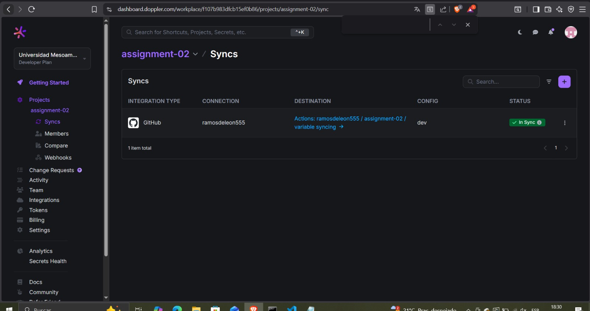
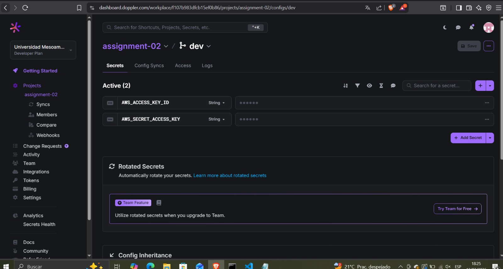
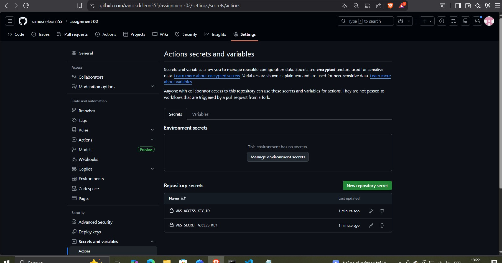
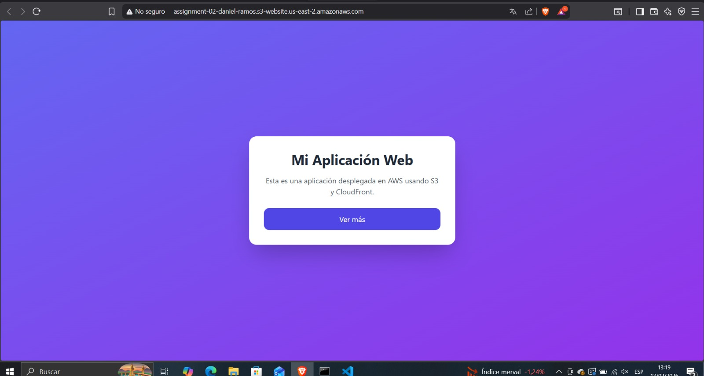

# Assignment 02 - Aplicación Web en CDN (AWS)

## URL pública del CDN
https://d37oxm50m5chc3.cloudfront.net

## Doppler - Config Syncs

## Doppler - Variables

## GitHub Secrets

## Captura de la aplicación

